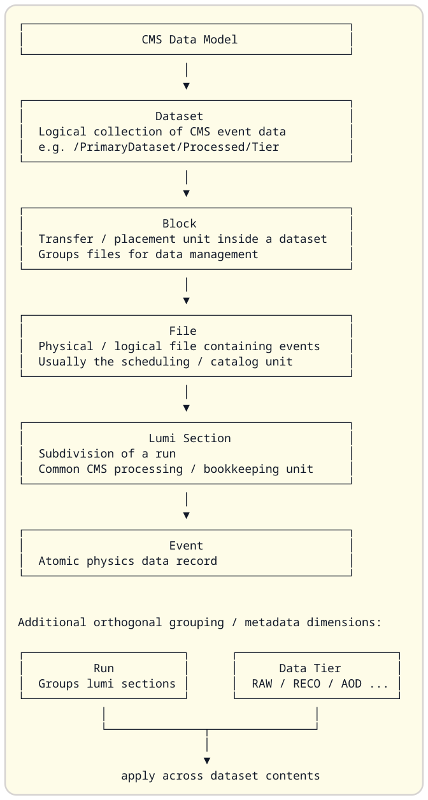

# Syntax controls
## Compilation fixture

- Author: mdBeamer[^suite]
- Author: Syntax Tester[^suite][^examples]
- Affiliation: [^suite] mdBeamer test suite, [^examples] Syntax reference examples
- Affiliation-Logo: [^suite] 
- Affiliation-Logo: [^examples] {width=8mm}
- Date: 2026-09-10

---

# Slide sizing[fontsize=\tiny]
## Theme subtitle

SlideBody

- ListOne
  - ListTwo
    - ListThree

::: fontsize=\small

LocalBody

- LocalList

:::

RestoredBody

| Label | Value |
| :--- | ---: |
| InheritedTable | 42 |

---

# Sized tables[fontsize=\small]

::: table fontsize=\footnotesize width=100% widths="20%,60%,20%"

| Name | Description | Count |
| :--- | :---: | ---: |
| ExplicitTable | A longer description which wraps across multiple lines within the assigned column width. | 42 |

:::

AfterTable

::: fontsize=\tiny

::: table width=80%

| Label | Value |
| :--- | ---: |
| BlockTable | 17 |

:::

:::

---

# Tables inside columns[fontsize=\small]

::: columns

::: column width=55% valign=top

::: table fontsize=\tiny widths="35%,65%"

| Name | Description |
| :--- | :--- |
| ColumnTable | This text wraps within a table in a narrower Beamer column. |

:::

ColumnAfter

:::

::: column width=45% valign=top

::: fontsize=\footnotesize

```Python
print("inherited code size")
```

```Python[fontsize=\tiny]
print("explicit code size")
```

:::

:::

:::

---

# Title-only frame[fontsize=\tiny]

---

# Default sizing

DefaultBody

| Label | Value |
| :--- | ---: |
| DefaultTable | 89 |

---

# About this showcase[fontsize=\small]

Each slide exercises supported input syntax. The opening slide demonstrates
title metadata, including the affiliation and institute aliases.

- Font measurements on the first slides are used by the regression suite.
- Images use the existing files under the test directory's `png/` folder.
- Oversized table examples intentionally exceed the normal text width.
- Command-line examples are displayed as code; they do not execute commands.
- Navigation controls are hidden and the footer shows current and total frames.

---

# Heading levels[fontsize=\small]
## The first H2 is the frame subtitle

The following headings belong to the body, after this paragraph.

### H3 body heading

Text beneath H3.

#### H4 body heading

##### H5 body heading

###### H6 body heading

## A second H2 becomes a body heading

# A second H1 also becomes a body heading

---

This slide deliberately has no top-level heading.

::: fontsize=\small

### An untitled frame can still have a body heading

:::

The next line is a literal hash, not a heading:

#

---


---

# Paragraphs and inline formatting[fontsize="\small"]

This paragraph spans two source lines
which are joined with a space.

This is a separate paragraph with **bold**, __underscore bold__, *italic*,
_underscore italic_, and `inline_code()`.

Combined emphasis accepts ***triple stars*** and ___triple underscores___.

Mixed delimiters also work: **_bold outside_**, __*bold outside again*__,
*__italic outside__*, and _**italic outside again**_.

An [ordinary link](https://example.org) and a [**bold label**](https://example.org/docs).

Literal LaTeX-sensitive characters are escaped: \ { } $ & % # _ ^ ~.

Inline code also preserves these characters: `a_b = {x: 50%}; $ & # \`.

Inline math preserves LaTeX syntax: $E^2 = p^2c^2 + m^2c^4$. Кирилица remains visible.

$$
\begin{aligned}
f(x) &= \frac{1}{\sigma\sqrt{2\pi}} \\
g(x) &= x_i^2 + \text{Хигс сектор}
\end{aligned}
$$

---

# HTML comments[fontsize=\small]

This sentence has an <!-- ignored inline note --> invisible inline comment.

<!-- This complete comment line is omitted. -->

The following multiline comment contains Markdown structure, but it does not
create slides, headings, directives, or footnotes.

<!--
---
# Hidden heading
::: fontsize=\tiny
[^hidden]: Hidden footnote
:::
-->

This text remains on the same slide after the multiline comment.

---

# Unordered lists[fontsize=\small]

- Dash marker with **bold text**.
+ Plus marker with *emphasis*.
* Asterisk marker with `code` and a [link](https://example.org).
  - A second-level item.
    + A third-level item.
- An item whose text
  continues on an indented source line.

- A blank source line does not necessarily end the list.

---

# Ordered lists[fontsize=\small]

7. Source numbering is replaced by generated numbering.
8. A second item.
   1. Nested ordered item.
      1. Third-level ordered item.
   2. Another nested item.
9. A final item with text
   continued on the next source line.

---

# Fences and literal separators[fontsize=\small]

```
Unlabelled backtick fence.
<!-- HTML comment syntax stays literal inside a fence. -->
---
The separator above stays inside the listing.
```

~~~Python
for number in range(2):
    print(number)
~~~

~~~
Unlabelled tilde fence: { } $ & % # _ ^ ~
~~~

---

# Code size and directive literals[fontsize=\footnotesize]

```Python
print("inherits the slide size")
```

```[fontsize='\tiny']
A fence can specify a size without a language.
```

::: fontsize="\small"

```Python[fontsize="\scriptsize"]
print("explicit size overrides the enclosing block")
```

```
::: table width=120%
:::
Literal container markers stay in this listing.
```

:::

---

# Small font commands

::: fontsize=\tiny

tiny sample

:::

::: fontsize='\scriptsize'

scriptsize sample

:::

::: fontsize="\footnotesize"

footnotesize sample

:::

::: fontsize=\small

small sample

:::

::: fontsize=\normalsize

normalsize sample

:::

---

# Large font commands

::: fontsize=\large

large sample

:::

::: fontsize=\Large

Large sample

:::

::: fontsize=\LARGE

LARGE sample

:::

---

# Largest font commands

::: fontsize=\huge

huge sample

:::

::: fontsize=\Huge

Huge sample

:::

---

# Nested font scopes[fontsize='\footnotesize']

Slide-level text.

::: fontsize=\small

Outer scope.

::: fontsize=\tiny

Inner scope.

- An inner list inherits tiny.

:::

Outer scope restored.

:::

Slide scope restored.

---

# Standalone image with defaults


---

# Image dimensions: relative[fontsize=\small]

Bare numeric dimensions are fractions of the current line width.

{width=0.25 height=0.18}

Percentages also use the current line width, including height.

{width="25%" height='18%'}

---

# Image dimensions: LaTeX lengths[fontsize=\small]

{width=0.25\linewidth height=0.15\textheight}

{width=0.25\textwidth height=12mm}

{width=2cm height=0.5in}

{width=40pt height=4em}

{width=8ex height=5ex}

---

# Automatic left image[fontsize=\small]

{width=1.0 height=0.5\textheight}

- The image gets a 35% column.
- Other body content gets the remaining 65%.
- Both columns align at the top.

---

# Automatic right image[fontsize=\small]

The placement suffix is case-insensitive.

{width=95% height=0.5\textheight}

- This text precedes the image in the generated column order.

---

# Automatic placement with default widths[fontsize=\small]

{height=0.5\textheight}

The image defaults to 40% and the other content to 60%.

---

# Automatic right placement with default widths[fontsize=\small]

{height=0.5\textheight}

The same default proportions apply to a right-hand image.

---

# Explicit column widths and alignment[fontsize=\small]

::: columns
::: column width='1/3' valign=top

### Top

Fractional width.

One more paragraph makes this column taller.

:::
::: column width="1/3" valign=center

### Center

Centered vertically.

:::
::: column width=1/3 valign=bottom

### Bottom

Bottom aligned.

:::
:::

---

# Default column widths and alignment aliases[fontsize=\small]

::: columns
::: column valign=t

Top alias; equal width.

Another line of content.

:::
::: column valign=c

Center alias.

:::
::: column valign=b

Bottom alias.

:::
:::

::: columns
::: column

Default top alignment.

:::
::: column

Default equal width.

:::
:::

---

# Font scope around columns[fontsize=\small]

::: fontsize=\tiny

::: columns
::: column width=50%

### Local body heading

- A list within the font scope.
- Another item.

:::
::: column width=50%

{width=0.6 height=0.3\textheight}

:::
:::

:::

Outside text returns to the slide font.

---

# Nested column containers[fontsize=\small]

::: columns
::: column width=60%

::: columns
::: column

Inner left.

:::
::: column

Inner right.

:::
:::

:::
::: column width=40%

Outer right.

:::
:::

---

# Natural tables and inline cells[fontsize=\small]

This table follows a paragraph without a blank line.
Name | Style | Count
:--- | :---: | ---:
**Alpha** | *italic* | 42
`Beta` | [link](https://example.org) | 17

::: table fontsize='\tiny'

| Name | Value |
| --- | ---: |
| Size only | 89 |

:::

The size-only directive keeps natural-width columns.

::: table

| Name | Value |
| --- | ---: |
| No attributes | 25 |

:::

---

# Wrapping table defaults[fontsize=\small]

::: table width="80%"

| Name | Description |
| :--- | :--- |
| Equal shares | Width alone enables wrapping with equal columns. |

:::

::: table widths='25%, 75%'

| Name | Description |
| :--- | :--- |
| Full width | Proportions alone use the available line width. |

:::

---

# Oversized table: percentage[fontsize=\small]

This slide intentionally requests a table wider than the text area.

::: table fontsize=\tiny width=120% widths="20%,20%,60%"

| Source | Status | Description |
| :--- | :---: | :--- |
| DBS | Ready | Overall width is 120%; column shares still total 100%. |

:::

---

# Tables with native LaTeX widths[fontsize=\small]

::: table fontsize=\tiny width=8cm widths="25%,75%"

| Width | Description |
| :--- | :--- |
| Physical | Eight centimeters, passed directly to LaTeX. |

:::

::: table fontsize=\tiny width=0.9\linewidth widths="25%,75%"

| Width | Description |
| :--- | :--- |
| Relative | A native multiple of the current line width. |

:::

::: table fontsize=\tiny width=\textwidth widths="25%,75%"

| Width | Description |
| :--- | :--- |
| Macro | The predefined text-width length. |

:::

---

# Table width expression[fontsize=\small]

::: table fontsize=\tiny width="\dimexpr\linewidth - 1cm\relax" widths="20%,20%,60%"

| Source | Status | Description |
| :--- | :---: | :--- |
| DBS | Ready | A quoted expression can contain spaces and length arithmetic. |

:::

---

# Oversized table: native length[fontsize=\small]

This is the native LaTeX equivalent of the percentage example.

::: table fontsize=\tiny width=1.2\linewidth widths="20%,20%,60%"

| Source | Status | Description |
| :--- | :---: | :--- |
| DBS | Ready | The length is passed through unchanged. |

:::

---

# Ordinary footnotes[fontsize=\small]

This paragraph references a source.[^source]

- A list item can contain a footnote.[^detail]
- Referencing the same key again emits another ordinary footnote.[^source]

This reference uses the slide size while its footer text is independently tiny.[^compact]

[^source]: [Example source](https://example.org)
[^detail]: A definition with a continuation.
    This indented line belongs to the same definition.
[^compact][fontsize=\tiny]: An independently sized footnote.

---

# Slide-local footnotes[fontsize=\small]

[^source]: This definition belongs only to this slide.

A definition can precede its reference.[^source]

The key reused from the previous slide resolves to the local definition.

---

# Footnotes below columns[fontsize=\small]

::: columns
::: column width=50%

Left reference.[^left]

Another reference to the same text.[^duplicate]

:::
::: column width=50%

Right reference.[^right]

The shared source is reused here.[^left]

:::
:::

[^left]: Shared source text.
[^duplicate]: Shared source text.
[^right]: A different source appears with its own letter.

---

# Footnotes in table cells[fontsize=\small]

::: columns
::: column width=100%

::: table fontsize=\footnotesize width=100% widths="30%,70%"

| Source | Description |
| :--- | :--- |
| DBS[^table] | A cell reference uses the column footnote mechanism. |

:::

:::
:::

[^table]: Table source, displayed below the columns.

---

# Converter command-line options[fontsize=\small]

These are usage examples, not commands executed by the document.

```[fontsize=\tiny]
python3 mdBeamer.py input.md -o output.tex --warnings warnings.txt
python3 mdBeamer.py input.md --output output.tex
python3 mdBeamer.py --help
python3 mdBeamer.py -h
```

```[fontsize=\tiny]
python3 mdBeamer.py input.md -o output.tex \
  --theme Warsaw --colortheme dove --fonttheme professionalfonts \
  --innertheme rectangles --outertheme infolines \
  --text-margin-left 5mm --text-margin-right 5mm \
  --list-indent 1.2em \
  --list-indent-1 1.5em --list-indent-2 1.25em --list-indent-3 1.1em \
  --list-label-sep 0.35em --list-item-sep 0.15em \
  --list-top-sep 0.2em --list-parse-sep 0pt
```

---

# Build and preview entry points[fontsize=\small]

Run these examples from the mdBeamer directory.

```[fontsize=\tiny]
./mdBeamer.sh test/syntax_controls.md --theme Warsaw
./preview.sh test/syntax_controls.md --theme Warsaw
```

The build wrapper generates TeX and compiles a PDF. The preview wrapper watches
the Markdown input for changes. Neither command is executed by this slide.

---

# Header level one
## Subtitle level two

The title uses Large; the subtitle uses large.

---

## Header level two[fontsize=\tiny]
### Subtitle level three

The title uses large, the subtitle uses normalsize, and the body uses tiny.

---

### Header level three
#### Subtitle level four

The title uses normalsize; the subtitle uses small.

---

#### Header level four
##### Subtitle level five

The title uses small; the subtitle uses footnotesize.

---

##### Header level five
###### Subtitle level six

The title uses footnotesize; the subtitle uses scriptsize.

---

###### Header level six

The title uses scriptsize. No deeper heading level is supported.

---

# Slide Title[fontsize=\small]
## Slide subtitle
### Slide subsubtitile

# Some section header here
some text here

## Some subsection header here
some more text and bullets here

- The three opening headings belong to the slide header.
- The later section and subsection headings belong to the body.

---

### A title starting at level three[fontsize=\small]
##### A subtitle starting at level five
###### A further header line at level six

## A body section after the header sequence

The header sequence may start at any supported level and skip levels.
The shallower section heading ends that sequence.
